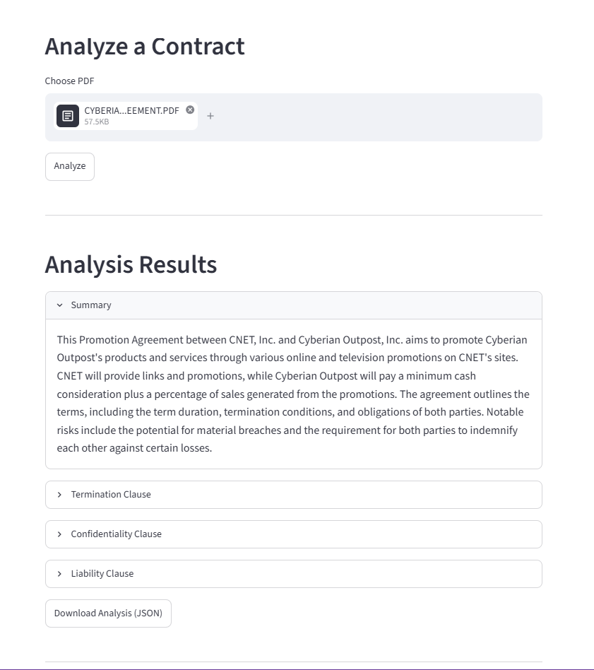
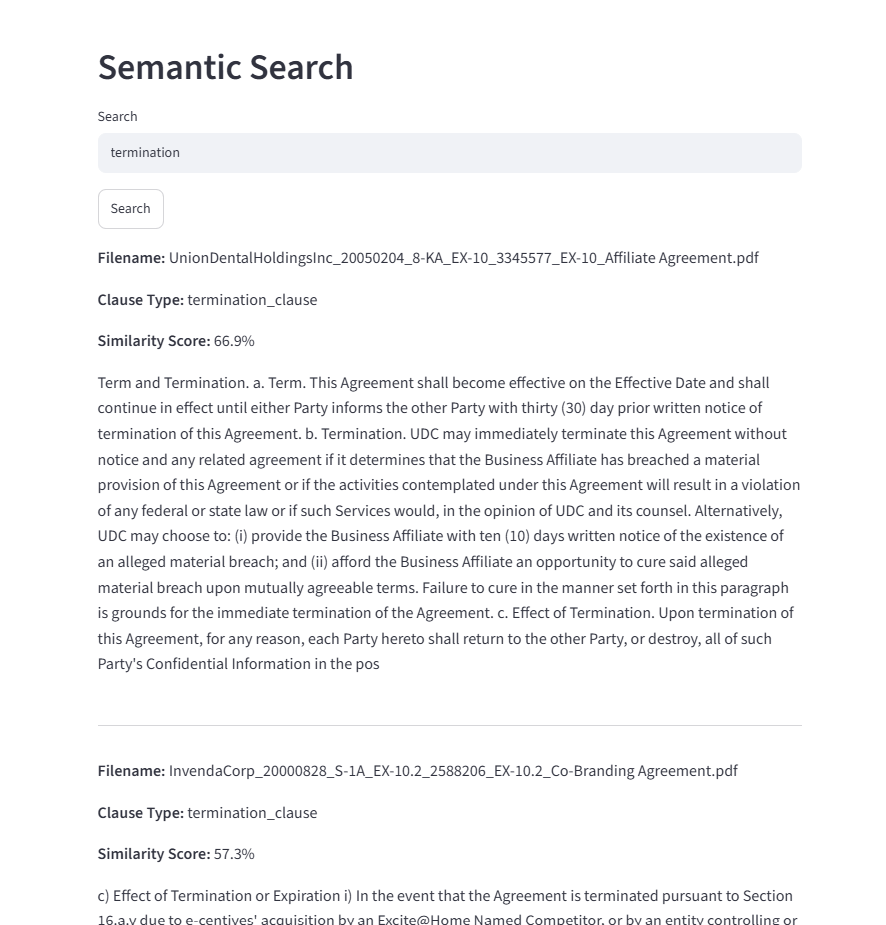

# Contract Intelligence


An AI-powered legal contract analysis system that combines Large Language Models (LLMs) with semantic search to help users quickly understand legal agreements.

The application generates concise contract summaries, extracts important legal clauses, and enables semantic search across previously processed contracts through a simple Streamlit interface.

---

## Project Overview

Legal contracts are often lengthy and time consuming to review manually. This project automates the process by using an LLM to summarize contracts and identify key legal clauses while also allowing semantic retrieval of similar clauses from a collection of contracts.

This project demonstrates the application of Large Language Models (LLMs) and semantic search for automated legal contract analysis.

---

## Features

- Upload and analyze PDF contracts
- AI-generated contract summaries
- Automatic extraction of:
  - Termination Clause
  - Confidentiality Clause
  - Liability Clause
- Semantic clause search using vector similarity
- Interactive Streamlit web interface
- Export structured analysis as JSON

## Demo Features

- Upload a legal contract in PDF format
- Generate an AI-powered summary
- Extract key legal clauses
- Search semantically similar clauses
- Export results as JSON

---

## System Architecture

```
                  PDF Contract
                        │
                        ▼
             PyMuPDF Text Extraction
                        │
                        ▼
         Groq LLM (Llama 3.3 70B)
                        │
        ┌───────────────┴───────────────┐
        ▼                               ▼
 Contract Summary             Clause Extraction
        │                               │
        └───────────────┬───────────────┘
                        ▼
              Streamlit Application
                        │
                        ▼
               JSON Analysis Output


 Offline Pipeline

 CUAD Contracts
        │
        ▼
 Clause Extraction
        │
        ▼
 Sentence Transformer Embeddings
        │
        ▼
     FAISS Vector Index
        │
        ▼
   Semantic Clause Search
```

---

## Tech Stack

| Component | Technology |
|-----------|------------|
| Language | Python |
| Frontend | Streamlit |
| LLM | Groq (Llama 3.3 70B) |
| Embeddings | Sentence Transformers |
| Vector Database | FAISS |
| PDF Processing | PyMuPDF |
| Environment | Python Virtual Environment |

---

## Project Structure

```text
.
├── app.py
├── config/
│   └── settings.py
├── data/
├── outputs/
├── src/
│   ├── clause_extractor.py
│   ├── summarizer.py
│   ├── semantic_search.py
│   ├── embeddings.py
│   ├── llm_client.py
│   └── prompts.py
├── requirements.txt
└── README.md
```

---

## Installation

### Clone the repository

```bash
git clone https://github.com/Aryan029029/contract-intelligence.git
```

### Navigate to the project

```bash
cd cuad-pipeline
```

### Create a virtual environment

```bash
python -m venv venv
```

### Activate the virtual environment

Windows

```bash
venv\Scripts\activate
```

### Install dependencies

```bash
pip install -r requirements.txt
```

### Create a `.env` file

```env
GROQ_API_KEY=your_groq_api_key
```

### Run the application

```bash
streamlit run app.py
```

---

## How It Works

### Contract Analysis

1. Upload a legal contract in PDF format.
2. The contract text is extracted using PyMuPDF.
3. The Groq LLM generates:
   - A concise contract summary
   - Termination clause
   - Confidentiality clause
   - Liability clause
4. Results are displayed in the Streamlit application.
5. Users can export the analysis as JSON.

### Semantic Search

The semantic search pipeline:

- Generates sentence embeddings for extracted clauses.
- Stores embeddings in a FAISS vector index.
- Retrieves semantically similar clauses based on natural language queries.

Example queries:

- termination
- breach of contract
- confidentiality
- liability
- indemnification
- damages

---

## Example Workflow

```
Upload PDF
      │
      ▼
Analyze Contract
      │
      ▼
Generate Summary
      │
      ▼
Extract Legal Clauses
      │
      ▼
Search Similar Clauses
      │
      ▼
Download JSON Results
```

---

## Future Improvements

- Support additional legal clause categories
- OCR support for scanned contracts
- Multi-contract comparison
- Contract risk scoring
- Question-answering over uploaded contracts
- Persistent vector database

---

## Screenshots


### Contract Analysis



---

### Semantic Search


---

## Dataset

The project uses contracts from the **CUAD (Contract Understanding Atticus Dataset)** for preprocessing and semantic search.

---

## License

## License

This project is licensed under the MIT License.
